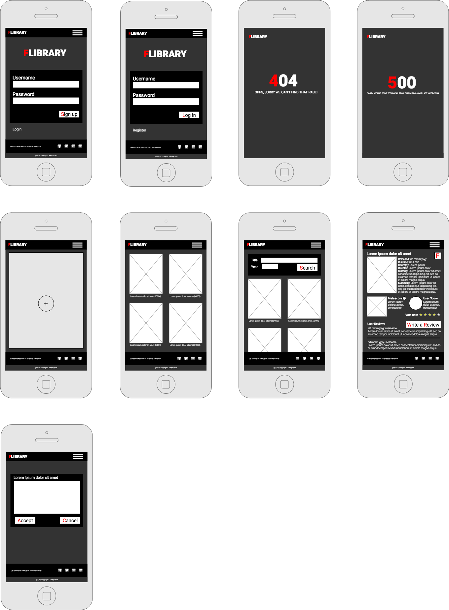

# FLIBRARY

- Flibrary is a web page where you can save a list of your favourite films and share comments and ratings with other users.

- Front end: https://github.com/Arkhanne/flibrary-front

- Back end: https://github.com/Arkhanne/flibrary-back

## User Stories

  **404:** As an anon/user I can see a 404 page if I try to reach a page that does not exist so that I know it's my fault.

  **500:** - As a user I want to see a nice error page when the super team screws it up so that I know that is not my fault.
  
  **Signup:** As an anon I can sign up in the platform so that I can start saving favourite films.
  
  **Login:** As a user I can login to the platform so that I can see my favourite films.
  
  **Logout:** As a user I can logout from the platform so no one else can use it.

  **Search films:** As a user I can search films so that a can choose one to add to favourites.

  **Add to favourites:** As a user I want to add a film to favourite so that I can save the films that I like.

  **List films:** As a user I want to see my favourite films so that I can choose one to see detailed information.

  **Film Detail:** As a user I want to see the details of a film so that I can rate and comment it.

  **Rate film:** As a user I want to rate a film in my favourite list and to change my previous rate.

  **Review film:** As a user I want to add comments to a film in my favourite list.

## Backlog

  **Film Detail:** As a user I would like to mark a film as viewed.

  **Film Detail:** As a user I would like to see the trailer.
  
# Client

## Routes

  - / 
  - /auth/signup - Signup form
  - /auth/login - Login form
  - /films - Films List Page
  - /films/:id - Film detail
  - /search - Search films
  - /rate/:id - Rate film
  - /review/:id - Review film

  ### Backlog

  - /trailer/:id - Film trailer

## Services

- Auth Service
  - auth.login(user)
  - auth.signup(user)
  - auth.logout()
  - auth.me()
  - auth.getUser()
  - auth.setUser()
- Films Service
  - films.getAll()
  - films.getOne(id)
  - films.search(title, [year])
  - films.favourite(id)
  - films.rate(id, rate)
  - films.review(id, review)

## Pages

- 404 Page
- 500 Page
- Sign up Page
- Log in Page
- Films Search Page
- Films List Page
- Film Detail Page
- Film Review Page

## Components

- Navbar component
- Films List component
- Film Card component
- Reviews List component
- Review Card component

## IO

- Login/Sign up form outputs the form to the parent component
- Films List inputs Film to Film Card component: Display all films in a grid.
- Reviews List inputs Review to Review card component: Display all reviews in a grid.

## Guards

- if logged in cannot access login/signup page
- if not logged in cannot access films search page
- if not logged in cannot access films list page
- if not logged in cannot access film detail page
- if not logged in cannot access film review page

# Server

## Models

  User model

  ```
  username - String // required
  password - // required
  ```

  Film model

  ```
  title - String // required
  year - number
  score - number
  reviews - [reviewID]
  users - [userID]
  ```

  Review model

  ```
  film - fimID
  user - userID
  date - Date
  text - String
  ```

## API Endpoints/Backend Routes

  - GET /auth/me
  - POST /auth/signup
  - POST /auth/login
  - POST /auth/me
  - POST /favourite
  - GET /films
  - GET /films/:id
  - GET /search
  - GET /rate
  - GET /review

## Wiframes


## Trello
https://trello.com/b/o1H7d24B/flibrary
